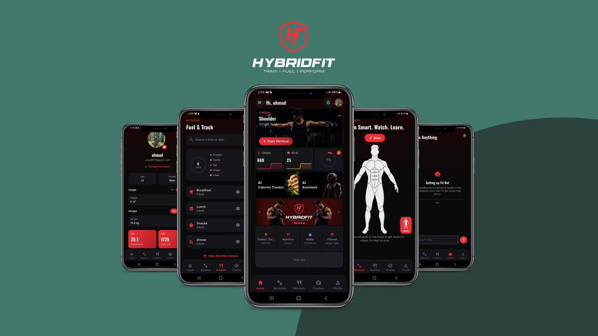

<!-- ============ AVATAR ============ -->

# Hi, I'm Ahmad Abdullah 👋

### Mobile & Web Application Developer

*"Get comfortable with being uncomfortable."*

Building modern mobile and web experiences with Flutter, Kotlin, Firebase, and modern web technologies.

 

 

 

## 🧑‍💻 About Me

I'm a Computer Science student (6th semester, **BS Computer Science**, Pak-Austria Fachhochschule) and a **Mobile & Web Application Developer** who enjoys turning ideas into real, working software.

Most of my hands-on experience is in **Flutter and Firebase-based mobile apps**, but I also build **web applications** with React/Next.js, and I'm steadily working AI/ML features into my projects — from an on-device chatbot to computer-vision components.

Across my repositories you'll find:

- 📱 **Mobile apps** — fitness, e-commerce, Islamic learning tools, and utility apps built with Flutter
- 🌐 **Web applications** — a full business website rebuilt across three different backend stacks, plus a Flask-based attendance system
- 🔥 **Firebase-backed products** — auth, Firestore, and real-time chat/notifications powering a full mobile + web admin ecosystem
- 🤖 **AI-assisted features** — an on-device fine-tuned LLM chatbot with a FastAPI-hosted fallback

I like shipping practical, functional software over polishing things I'll never finish — every repository below is something I actually built and can walk you through.

 

## 🛠️ Technology Stack

**Mobile Development**

**Web Development**

**Backend & Database**

**AI / Machine Learning**

**Tools**

 

## 🚀 Featured Projects

### 💪 Hybrid Fit — a full mobile + web fitness ecosystem

My most complete project — a fitness app with a companion admin panel and an AI coaching assistant, all sharing one Firebase backend. The Flutter app itself covers step & calorie tracking, nutrition logging, water intake, BMI/BMR profile metrics, a muscle-group picker that surfaces targeted workout videos, and an in-app **Fit Bot** chat assistant — backed by the repos below.

<table>
<tr>
<td width="50%" valign="top">

**[Hybrid Fit — Web Admin Panel](https://github.com/ahmadabdullah414/Hybrid-Fit-Web-Admin-Panel)**
`Next.js 16` `TypeScript` `Tailwind CSS` `Firebase`

A web dashboard for managing the Hybrid Fit mobile app:
- Member directory with health metrics (BMI, BMR, height/weight)
- Premium-user filtering and search
- Owner chat inbox — pin, star, and search conversations, full message thread with read receipts
- Home-screen banner carousel manager
- Broadcast notifications to all members
- Admin-only Firebase Auth (email/password + Google)

</td>
<td width="50%" valign="top">

**[HybridFIT — Assistant](https://github.com/ahmadabdullah414/HybridFIT--Assistant)**
`Python` `FastAPI` `Docker`

An AI fitness-coach chatbot for the app, built two ways:
- **On-device**: a fine-tuned Qwen2.5-0.5B (GGUF, quantized) model the Flutter app downloads and runs fully offline via llama.cpp
- **Hosted API**: the same pipeline (language detection → intent classification → safety gate → generation) exposed over FastAPI and deployed on Hugging Face Spaces

</td>
</tr>
</table>

**[HybridFit — Food Recognition Model](https://github.com/ahmadabdullah414/HybridFit-Food-Recognition-Model)** — the planned computer-vision component for food/calorie recognition in the app; currently set up as the starting point for that work.

 
Home dashboard, nutrition tracking, muscle-group workout picker, and the on-device Fit Bot assistant

---

### 🌐 ArdntLogic Website — one site, three backend stacks

A full-stack business website with a working contact form (name/email/phone/service/budget → email delivery), rebuilt across three different backend approaches to practice different architectures:

| Repository | Backend Approach |
|---|---|
| [Ardnt-Logic-Web-App-React-Node.js-Express.js](https://github.com/ahmadabdullah414/Ardnt-Logic-Web-App-React-Node.js-Express.js) | React + TypeScript + Express.js + PostgreSQL (Drizzle ORM) |
| [Ardnt-Logic-Web-App-React-PHP](https://github.com/ahmadabdullah414/Ardnt-Logic-Web-App-React-PHP) | React frontend with a PHP backend |
| [Ardnt-Logic-Web-App-Email-Js](https://github.com/ahmadabdullah414/Ardnt-Logic-Web-App-Email-Js) | React frontend with client-side EmailJS delivery |

Shared tech across the stack: React 18, TypeScript, Tailwind CSS, Vite, React Hook Form + Zod validation, Nodemailer/Gmail SMTP for email delivery.

---

### 🍽️ Student Mess Attendance System

**[View Repository](https://github.com/ahmadabdullah414/Student-Mess-Attendance)** · `Python` `Flask` `SQLite`

A complete web app for managing student mess attendance in university hostels:
- Secure admin login with hashed passwords (Werkzeug)
- Dashboard with live stats (total students, present/absent today)
- Full student CRUD (add, edit, delete, view)
- One-click attendance marking via AJAX — no page reloads
- Date-based attendance history and **CSV export**
- SQL-injection-safe, parameterized queries throughout

---

### 📱 More Projects

| Project | Tech | What it does |
|---|---|---|
| **[KFR — Khan Food Restaurant App](https://github.com/ahmadabdullah414/KFR-Khan-Food-Restuarant-App)** | Flutter · Firebase | Food-ordering app for a real restaurant — menu browsing, ordering, and order notes/customization |
| **[TrackEx](https://github.com/ahmadabdullah414/TrackEx)** | Flutter | Income & expense tracker with daily, weekly, monthly, and yearly views and filtering |
| **[Qaida App](https://github.com/ahmadabdullah414/Qaida-App-)** | Flutter | "Qaida — Learn to Read the Quran": an audio-guided Islamic reading-fundamentals app |
| **[SoyIN — Reto Mundialista](https://github.com/ahmadabdullah414/SoyIN)** | Flutter · Firebase | A World Cup–themed step-count and weight-loss challenge app with Google/Apple sign-in |
| **[Gold Finder App](https://github.com/ahmadabdullah414/Gold-Finder-App)** | Flutter | Gold valuation calculator supporting tola, masha, and ratti units against a live-entered market rate |
| **[Flower Shop App](https://github.com/ahmadabdullah414/Flower-Shop-App)** | Flutter | Flower e-commerce app — browsing, ratings, personalized accounts, and checkout |
| **[Counter App](https://github.com/ahmadabdullah414/Counter-App)** | Flutter | A minimalist Zikr counter — increment, decrement, and reset with a clean, distraction-free UI |
| **[Notes App](https://github.com/ahmadabdullah414/Notes-App)** | Flutter | A simple app for creating and managing personal notes |
| **[React Movies App](https://github.com/ahmadabdullah414/React-Movies-App)** | Expo · React Native · TypeScript | A cross-platform (iOS/Android/web) movie-browsing app using Expo Router and React Navigation |
| **[Fiver Reply Extension](https://github.com/ahmadabdullah414/Fiver-Reply-Extension)** | JavaScript | A browser extension (content + background scripts with a popup UI) to speed up replying to Fiverr messages |
| **[app-ads](https://github.com/ahmadabdullah414/app-ads)** | — | Hosts an `app-ads.txt` file used to verify authorized ad-seller status for AdMob-monetized apps |
| **[Ahmad's Portfolio Card](https://github.com/ahmadabdullah414/Ahmad-s-Portfolio-Card)** | HTML/CSS | A single-page personal portfolio/business card |

📌 19 public repositories total — <a href="https://github.com/ahmadabdullah414?tab=repositories">browse them all on GitHub →</a>

 

## 💼 Experience

**Mobile App Developer — Quran Cube**

Worked on multiple Android/mobile applications, including an English learning app (WordCube Phonics), a Salah (prayer) learning app, and interactive/educational mini-apps such as a maze game.

- Developed and maintained mobile application features end-to-end
- Fixed bugs and improved application stability across Android versions, including older devices
- Implemented UI and integrated audio/content for interactive lessons
- Tested applications for Android compatibility
- Worked primarily with Kotlin, alongside Flutter

 

## ⚡ What I Do

| | |
|---|---|
| 📱 Mobile Application Development | 🌐 Web Application Development |
| 🎨 UI Implementation | 🔥 Firebase Integration |
| 🤖 AI/ML Integration | 🗄️ Database Development |
| 🔧 Debugging & Optimization | 📦 API Integration |
| 🚀 Application Deployment | | 

 

## 📊 GitHub Statistics

If a card above doesn't render immediately, GitHub's stats cache may just need a refresh — reloading the page usually fixes it.

 

## 📚 Currently Learning & Exploring

- Advanced Flutter development
- Kotlin / Android development
- AI/ML integration
- Modern web development
- Backend architecture
- Application optimization
- UI/UX design

 

## 🎯 Future Goals

- Building scalable, production-ready mobile applications
- Developing more AI-powered application features
- Improving full-stack development skills
- Creating useful products that solve real-world problems
- Contributing to open-source projects
- Growing as a professional software engineer

 

## 🤝 Connect With Me

 

## 💭 Summary

I enjoy building useful software, learning new technologies, and turning ideas into applications people can actually use — whether that's a fitness app with an AI coach, a business site rebuilt across three stacks just to understand the trade-offs, or a small utility app that solves one problem well.

 

Thanks for visiting my profile! 🙌

**Let's build something meaningful together.**

